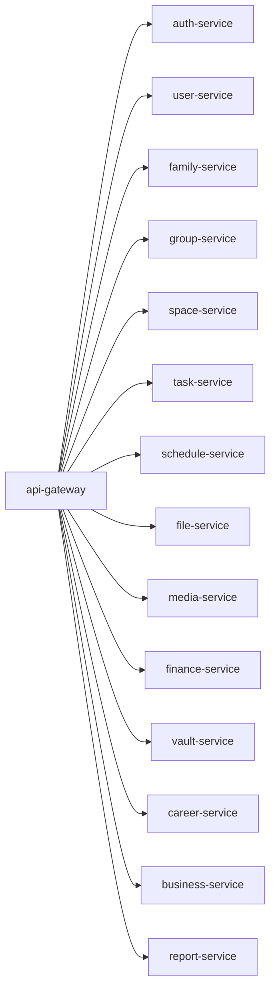

# 🏗️ Arquitectura General — LifeTrack OS

> Para ver el contexto completo ir al [README principal](./README.md)

---

## Principios de Diseño

| Principio | Cómo se aplica |
|-----------|---------------|
| Arquitectura Hexagonal | `domain/` no importa NestJS, Prisma ni NATS. Solo entidades, puertos y reglas de negocio. |
| DB per Service | Cada microservicio tiene su propia base de datos. Nadie accede tablas ajenas directamente. |
| API Gateway único | Ningún frontend llama directo a microservicios. Todo pasa por el Gateway. |
| Contratos versionados | Protobuf `.proto` y schemas de eventos viven en `lifetrack-contracts`. |
| Outbox Pattern | Eventos se guardan en la misma transacción del cambio. Worker los publica a NATS. |
| Correlation ID | Todo request lleva un ID único que viaja por gRPC metadata y eventos NATS. |

---

## Reglas de Comunicación

| Canal | Cuándo | Ejemplo |
|-------|--------|---------|
| REST/HTTPS | Entrada desde clientes web/móvil hacia Gateway | `POST /tasks`, `GET /spaces` |
| gRPC + Protobuf | Comunicación interna síncrona entre servicios | `gateway → task-service.CreateTask` |
| NATS JetStream | Eventos de dominio asíncronos con persistencia | `task.created.v1`, `vault.secret_accessed.v1` |
| Redis | Cache, rate limit, locks, sesiones efímeras | Rate limit por usuario, lock de scheduler |
| WebSocket (futuro) | Notificaciones en tiempo real al frontend | Estado de tareas en vivo, alerts |

---

## Mapa de Microservicios

---

## Bases de Datos por Servicio

| DB | Servicios | ORM | Por qué |
|----|-----------|-----|---------|
| PostgreSQL | auth, user, family, group, space, task, schedule, file, finance, vault, business | Prisma / TypeORM | ACID, relacional, migraciones tipadas |
| MongoDB | space (plantillas), career, report, notification, media | Mongoose | Esquemas flexibles, buen para read models |
| DynamoDB | audit-service | AWS SDK v3 | Append-only, sin servidor, escala automática |
| Redis | api-gateway, schedule, vault (cache) | ioredis | In-memory, rate limit, locks |
| S3 / MinIO | file-service, media-service | AWS SDK v3 | Object storage, presigned URLs |

---

## Fases de Desarrollo

| Fase | Nombre | Entregable |
|------|--------|-----------|
| 0 | Fundación | contracts + infra local + NATS + Postgres + Redis + MinIO |
| 1 | Identidad | auth-service + user-service + api-gateway + OAuth |
| 2 | Grupos y Espacios | family + group + space-service con plantillas |
| 3 | Productividad | task-service + schedule-service + notificaciones básicas |
| 4 | Archivos y Media | file-service + media-service + vault-service |
| 5 | Finanzas y Negocios | finance + business + career-service |
| 6 | Observabilidad | audit + report + Prometheus + Grafana + OpenTelemetry |
| 7 | Frontend | Next.js shell + microfrontends + React Query + Zustand |
| 8 | CI/CD y Testing | GitHub Actions + Jenkins + SonarQube + BDD + TDD + E2E |
| 9 | Cloud Real | EC2 → ECS Fargate → Kubernetes (EKS) |

---

> Detalles de implementación → [Backend](./BACKEND.md) · [Frontend](./FRONTEND.md) · [DevOps](./DEVOPS.md) · [CI/CD](./CICD.md)
