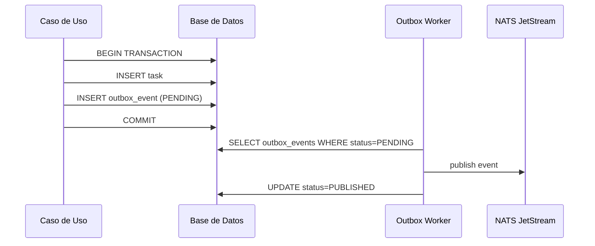

# ⚙️ Backend y Microservicios — LifeTrack OS

> Para ver el contexto completo ir al [README principal](./README.md)

---

## Estructura Interna de cada Microservicio (Hexagonal)

```
lifetrack-{service}/
  src/
    domain/               # Núcleo puro — sin dependencias externas
      entities/           # Entidades de negocio
      value-objects/      # Value objects inmutables
      events/             # Eventos de dominio (interfaces)
      ports/              # Interfaces de repositorios y servicios
    application/          # Orquestación — casos de uso
      commands/
      queries/
      use-cases/
      dto/
    infrastructure/       # Adaptadores externos
      database/           # Prisma / Mongoose
        repositories/     # Implementa ports del dominio
      messaging/
        nats.publisher.ts
        outbox.worker.ts  # Lee outbox y publica a NATS
      grpc/
        clients/
    presentation/         # Controladores gRPC / HTTP health
    shared/               # Logger, errors, tracing
    main.ts
  prisma/
    schema.prisma
    migrations/
  test/
    unit/                 # TDD — dominio y casos de uso
    integration/          # Testcontainers — con DB real
    bdd/                  # Gherkin + step definitions
  Dockerfile
  README.md
```

---

## Catálogo de Microservicios

### auth-service
| | |
|--|--|
| Función | Registro, login, OAuth 2.0 (Google/GitHub/Apple), refresh tokens, reset password |
| Storage | PostgreSQL + Prisma |
| Entidades | `auth_accounts`, `refresh_sessions`, `login_attempts`, `oauth_connections` |
| gRPC | `Register`, `Login`, `LoginWithOAuth`, `RefreshToken`, `ValidateToken`, `Logout` |
| Eventos NATS | `auth.user_registered.v1`, `auth.oauth_linked.v1`, `auth.session_revoked.v1` |
| Seguridad | Argon2id para hash. Refresh token rotación. Bloqueo tras 5 intentos. |

### vault-service
| | |
|--|--|
| Función | Bóveda de contraseñas cifradas. Backend NUNCA ve el secreto real. |
| Storage | PostgreSQL + Prisma |
| Entidades | `vault_items(encrypted_blob, salt, iv, encryption_version)`, `vault_access_logs` |
| gRPC | `CreateVaultItem`, `GetEncryptedVaultItem`, `UpdateVaultItem`, `DeleteVaultItem` |
| Eventos NATS | `vault.secret_created.v1`, `vault.secret_accessed.v1` — todo va a audit |
| Seguridad | Frontend cifra con AES-256-GCM. Backend solo guarda el blob cifrado. |

### task-service
| | |
|--|--|
| Función | Tareas, subtareas, asignaciones, comentarios, estados, prioridades |
| Storage | PostgreSQL + Prisma |
| Entidades | `tasks`, `task_assignees`, `subtasks`, `task_comments`, `task_status_history` |
| gRPC | `CreateTask`, `AssignTask`, `CompleteTask`, `ChangeStatus`, `AddComment`, `ListTasks` |
| Eventos NATS | `task.created.v1`, `task.assigned.v1`, `task.completed.v1`, `task.overdue.v1` |

### media-service *(nuevo)*
| | |
|--|--|
| Función | Guardar links web, videos (YouTube, Vimeo), recursos de aprendizaje, referencias |
| Storage | PostgreSQL (metadata) + MongoDB (tags flexibles) + S3 (thumbnails) |
| Entidades | `media_items(url, type, title, tags[], space_id)`, `collections` |
| gRPC | `SaveLink`, `SaveVideo`, `ListMedia`, `SearchMedia`, `AddToCollection` |
| Tipos | `LINK`, `VIDEO_YOUTUBE`, `VIDEO_VIMEO`, `DOCUMENT`, `ARTICLE`, `COURSE` |

### notification-service
| | |
|--|--|
| Función | Enviar push, email, in-app. Consume eventos de todos los servicios. |
| Storage | MongoDB + DynamoDB (historial) |
| Entidades | `notifications(title, body, status, channel)`, `templates`, `delivery_attempts` |
| gRPC | `ListNotifications`, `MarkAsRead`, `GetUnreadCount` |
| Consume NATS | `task.created`, `task.assigned`, `schedule.reminder_due`, `finance.budget_exceeded` |

---

## Contratos gRPC — lifetrack-contracts

```
lifetrack-contracts/
  proto/
    auth/v1/auth.proto
    task/v1/task.proto
    vault/v1/vault.proto
    media/v1/media.proto
    ... (un proto por servicio)
    common/v1/common.proto   # Pagination, Error, etc.
  events/
    auth.events.ts
    task.events.ts
    vault.events.ts
    ...
  buf.yaml                   # lint y breaking check
```

### Envelope estándar de eventos NATS

```typescript
export interface EventEnvelope<TPayload> {
  eventId: string;         // UUID único — para idempotencia
  eventType: string;       // ej: "task.created.v1"
  eventVersion: number;    // para migraciones
  occurredAt: string;      // ISO 8601
  producer: string;        // nombre del servicio
  correlationId: string;   // ID del request original
  actorUserId?: string;
  payload: TPayload;
}
```

---

## Outbox Pattern



---

## Testing Backend

| Capa | Tipo | Herramienta |
|------|------|-------------|
| `domain/` | Unit — TDD | Jest puro, sin mocks de infraestructura |
| `application/` | Unit — TDD | Jest con mocks de ports |
| `infrastructure/` | Integration | Testcontainers: Postgres/Mongo/NATS real |
| `presentation/` | Integration + Contract | Supertest + Pact |
| E2E | E2E completo | Supertest contra Gateway con Docker Compose |
| BDD | Behavior | Cucumber.js — features Gherkin por dominio |
| Performance | Load | k6 en endpoints críticos |

### Ejemplo BDD — Vault

```gherkin
Feature: Guardar secreto en la bóveda

  Background:
    Given el usuario "alice@test.com" tiene sesión activa

  Scenario: Guardar contraseña exitosamente
    When alice envía un vault_item cifrado con tipo "PASSWORD"
    Then el item se guarda con encrypted_blob en la base de datos
    And se publica el evento "vault.secret_created.v1" en NATS
    And audit-service registra el acceso con user_id de alice

  Scenario: Rechazar secreto sin cifrar
    When alice envía un vault_item con el secreto en texto plano
    Then el backend responde con error INVALID_ENCRYPTED_FORMAT
    And NO se publica ningún evento NATS
```

---

> Ver también: [Arquitectura](./ARCHITECTURE.md) · [Frontend](./FRONTEND.md) · [DevOps](./DEVOPS.md) · [CI/CD](./CICD.md)
