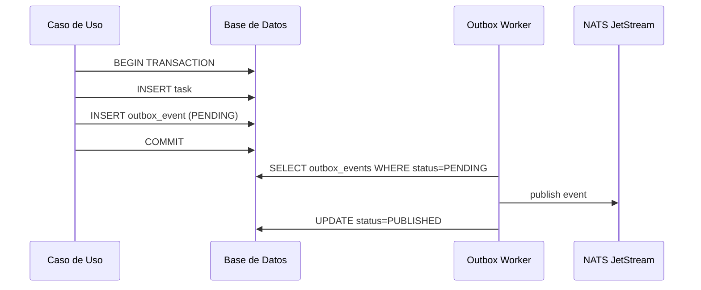

# ⚙️ Backend y Microservicios — LifeTrack OS

> Para ver el contexto completo ir al [README principal](./README.md)

---

## Estructura Interna de cada Microservicio (Hexagonal)

```
lifetrack-{service}/
  src/
    domain/               # Núcleo puro — sin dependencias externas
      entities/           # Entidades de negocio
      value-objects/      # Value objects inmutables
      events/             # Eventos de dominio (interfaces)
      ports/              # Interfaces de repositorios y servicios
    application/          # Orquestación — casos de uso
      commands/
      queries/
      use-cases/
      dto/
    infrastructure/       # Adaptadores externos
      database/           # Prisma / Mongoose
        repositories/     # Implementa ports del dominio
      messaging/
        nats.publisher.ts
        outbox.worker.ts  # Lee outbox y publica a NATS
      grpc/
        clients/
    presentation/         # Controladores gRPC / HTTP health
    shared/               # Logger, errors, tracing
    main.ts
  prisma/
    schema.prisma
    migrations/
  test/
    unit/                 # TDD — dominio y casos de uso
    integration/          # Testcontainers — con DB real
    bdd/                  # Gherkin + step definitions
  Dockerfile
  README.md
```

---

## Catálogo de Microservicios

> Arquitectura consolidada en 13 microservicios (ver [Arquitectura → Fases de Desarrollo](./ARCHITECTURE.md#fases-de-desarrollo) para el orden de construcción). `social-service` fusiona `family` + `group`; `task-service` incluye lo que sería `space-service`. `business-service` y `file-service` se eliminaron del diseño. Debajo solo están specificados en detalle los servicios que ya tienen diseño de entidades — el resto se especifica cuando entren en fase de construcción.

### auth-service
| | |
|--|--|
| Función | Registro, login, refresh tokens con rotación, logout, forgot/reset password |
| Storage | PostgreSQL + Prisma |
| Entidades | `Credential`, `RefreshToken`, `PasswordResetToken`, `OAuthLinkToken` |
| gRPC | `Register`, `Login`, `Refresh`, `Logout`, `ValidateToken`, `ForgotPassword`, `ResetPassword`, `LoginWithOAuth`, `LinkOAuthAccount` |
| Eventos NATS | `auth.user_registered.v1` |
| Seguridad | bcrypt para hash. Refresh token rotación con detección de reuso. Bloqueo de cuenta tras N intentos fallidos (`LOGIN_MAX_ATTEMPTS`). Rate limiting por IP en `api-gateway` sobre login/forgot-password/reset-password y flujos OAuth. Reset de contraseña vía token de un solo uso enviado por email (Resend), revoca todas las sesiones activas. |
| OAuth | Authorization Code + PKCE iniciado en `api-gateway` (`GET /auth/google`, `/auth/github`); intercambio de código y resolución de perfil en `auth-service` vía `OAuthProviderPort` (adapters Google/GitHub). Si el email OAuth coincide con una cuenta `LOCAL`, no hay merge automático: responde `ACCOUNT_LINK_REQUIRED` y el usuario confirma con password local en `POST /auth/link-account`. Cuentas solo-OAuth no tienen `passwordHash`; login local las rechaza con mensaje genérico. |
| Backlog deliberado | Migración a Argon2id — evaluada y pospuesta bajo YAGNI, no es un pendiente por descuido. |

### vault-service
| | |
|--|--|
| Función | Bóveda de contraseñas cifradas. Backend NUNCA ve el secreto real. |
| Storage | PostgreSQL + Prisma |
| Entidades | `vault_items(encrypted_blob, salt, iv, encryption_version)`, `vault_access_logs` |
| gRPC | `CreateVaultItem`, `GetEncryptedVaultItem`, `UpdateVaultItem`, `DeleteVaultItem` |
| Eventos NATS | `vault.secret_created.v1`, `vault.secret_accessed.v1` — todo va a audit |
| Seguridad | Frontend cifra con AES-256-GCM. Backend solo guarda el blob cifrado. |

### finance-service *(nuevo)*
| | |
|--|--|
| Función | Gestor de gastos e ingresos — cuentas, categorías, transacciones y presupuestos por período |
| Storage | PostgreSQL + Prisma |
| Entidades | `accounts(name, type, currency, balance)`, `categories(name, kind[INCOME\|EXPENSE], icon, color)`, `transactions(account_id, category_id, amount, kind, description, occurred_at)`, `budgets(category_id, amount, period_month, period_year)` |
| gRPC | `CreateAccount`, `CreateTransaction`, `ListTransactions`, `CreateBudget`, `GetBudgetStatus`, `ListAccounts` |
| Eventos NATS | `finance.transaction_created.v1`, `finance.budget_exceeded.v1` — consumido por `notification-service` |
| Reglas | `balance` de la cuenta se recalcula por trigger/aplicación al crear/editar/borrar una transacción, no se guarda derivado sin control. `GetBudgetStatus` compara gasto acumulado del mes contra `budgets.amount` y dispara `finance.budget_exceeded.v1` si se supera. |

### task-service
| | |
|--|--|
| Función | Tareas, subtareas, asignaciones, comentarios, estados, prioridades |
| Storage | PostgreSQL + Prisma |
| Entidades | `tasks`, `task_assignees`, `subtasks`, `task_comments`, `task_status_history` |
| gRPC | `CreateTask`, `AssignTask`, `CompleteTask`, `ChangeStatus`, `AddComment`, `ListTasks` |
| Eventos NATS | `task.created.v1`, `task.assigned.v1`, `task.completed.v1`, `task.overdue.v1` |

### rehab-service *(nuevo)*
| | |
|--|--|
| Función | Seguimiento de recuperación física — ejercicios, citas médicas, medidas de progreso y fotos, agrupados por `recovery_plan` (una lesión/parte del cuerpo a la vez, puede haber varias en paralelo) |
| Storage | PostgreSQL + Prisma (datos) + S3 (fotos de progreso) |
| Entidades | `recovery_plans(body_part, injury_type, surgery_date, status)`, `exercises(name, target_sets, target_reps, reference_media_url, phase)`, `exercise_logs(sets_done, reps_done, date)`, `appointments(date, provider, notes)`, `measurements(type, value, unit, date)`, `progress_photos(photo_url, date)` |
| gRPC | `CreateRecoveryPlan`, `LogExercise`, `AddAppointment`, `AddMeasurement`, `AddProgressPhoto`, `ListRecoveryProgress` |
| Eventos NATS | `rehab.plan_created.v1`, `rehab.exercise_logged.v1`, `rehab.appointment_added.v1` |

### media-service *(nuevo)*
| | |
|--|--|
| Función | Guardar links web, videos (YouTube, Vimeo), recursos de aprendizaje, referencias |
| Storage | PostgreSQL (metadata) + MongoDB (tags flexibles) + S3 (thumbnails) |
| Entidades | `media_items(url, type, title, tags[], space_id)`, `collections` |
| gRPC | `SaveLink`, `SaveVideo`, `ListMedia`, `SearchMedia`, `AddToCollection` |
| Tipos | `LINK`, `VIDEO_YOUTUBE`, `VIDEO_VIMEO`, `DOCUMENT`, `ARTICLE`, `COURSE` |

### notification-service
| | |
|--|--|
| Función | Enviar push, email, in-app. Consume eventos de todos los servicios. |
| Storage | MongoDB + DynamoDB (historial) |
| Entidades | `notifications(title, body, status, channel)`, `templates`, `delivery_attempts` |
| gRPC | `ListNotifications`, `MarkAsRead`, `GetUnreadCount` |
| Consume NATS | `task.created`, `task.assigned`, `schedule.reminder_due`, `finance.budget_exceeded` |

---

## Contratos gRPC — lifetrack-contracts

```
lifetrack-contracts/
  proto/
    auth/v1/auth.proto
    task/v1/task.proto
    vault/v1/vault.proto
    media/v1/media.proto
    ... (un proto por servicio)
    common/v1/common.proto   # Pagination, Error, etc.
  events/
    auth.events.ts
    task.events.ts
    vault.events.ts
    ...
  buf.yaml                   # lint y breaking check
```

### Envelope estándar de eventos NATS

```typescript
export interface EventEnvelope<TPayload> {
  eventId: string;         // UUID único — para idempotencia
  eventType: string;       // ej: "task.created.v1"
  eventVersion: number;    // para migraciones
  occurredAt: string;      // ISO 8601
  producer: string;        // nombre del servicio
  correlationId: string;   // ID del request original
  actorUserId?: string;
  payload: TPayload;
}
```

---

## Outbox Pattern


```mermaid
sequenceDiagram
    participant UC as Caso de Uso
    participant DB as Base de Datos
    participant OW as Outbox Worker
    participant NATS as NATS JetStream

    UC->>DB: BEGIN TRANSACTION
    UC->>DB: INSERT task
    UC->>DB: INSERT outbox_event (PENDING)
    UC->>DB: COMMIT
    OW->>DB: SELECT outbox_events WHERE status=PENDING
    OW->>NATS: publish event
    OW->>DB: UPDATE status=PUBLISHED
```

---

## Testing Backend

| Capa | Tipo | Herramienta |
|------|------|-------------|
| `domain/` | Unit — TDD | Jest puro, sin mocks de infraestructura |
| `application/` | Unit — TDD | Jest con mocks de ports |
| `infrastructure/` | Integration | Testcontainers: Postgres/Mongo/NATS real |
| `presentation/` | Integration + Contract | Supertest + Pact |
| E2E | E2E completo | Supertest contra Gateway con Docker Compose |
| BDD | Behavior | Cucumber.js — features Gherkin por dominio |
| Performance | Load | k6 en endpoints críticos |

### Ejemplo BDD — Vault

```gherkin
Feature: Guardar secreto en la bóveda

  Background:
    Given el usuario "alice@test.com" tiene sesión activa

  Scenario: Guardar contraseña exitosamente
    When alice envía un vault_item cifrado con tipo "PASSWORD"
    Then el item se guarda con encrypted_blob en la base de datos
    And se publica el evento "vault.secret_created.v1" en NATS
    And audit-service registra el acceso con user_id de alice

  Scenario: Rechazar secreto sin cifrar
    When alice envía un vault_item con el secreto en texto plano
    Then el backend responde con error INVALID_ENCRYPTED_FORMAT
    And NO se publica ningún evento NATS
```

---

> Ver también: [Arquitectura](./ARCHITECTURE.md) · [Frontend](./FRONTEND.md) · [DevOps](./DEVOPS.md) · [CI/CD](./CICD.md)
