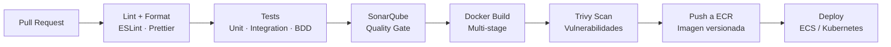

# 🔁 CI/CD y Calidad — LifeTrack OS

> Para ver el contexto completo ir al [README principal](./README.md)

---

## Pipeline Completo



El pipeline **bloquea el deploy** si falla cualquier paso. No hay merge a `main` si SonarQube no pasa.

---

## GitHub Actions

```yaml
# .github/workflows/ci-cd.yml
name: CI/CD — auth-service
on:
  push:
    branches: [main, develop]
    paths: ["services/auth-service/**"]
  pull_request:
    paths: ["services/auth-service/**"]

jobs:
  quality:
    runs-on: ubuntu-latest
    steps:
      - uses: actions/checkout@v4
      - uses: actions/setup-node@v4
        with: { node-version: "20", cache: "npm" }
      - run: npm ci
      - run: npm run lint
      - run: npm run format:check
      - run: npm run test:unit
      - run: npm run test:integration    # Testcontainers
      - name: SonarQube Analysis
        uses: sonarsource/sonarqube-scan-action@master
        env:
          SONAR_TOKEN: ${{ secrets.SONAR_TOKEN }}
          SONAR_HOST_URL: ${{ secrets.SONAR_URL }}
      - name: Quality Gate
        uses: sonarsource/sonarqube-quality-gate-action@master
        env: { SONAR_TOKEN: ${{ secrets.SONAR_TOKEN }} }

  build-and-push:
    needs: quality
    if: github.ref == 'refs/heads/main'
    steps:
      - name: Build Docker image
        run: docker build -t auth-service:${{ github.sha }} .
      - name: Trivy scan
        uses: aquasecurity/trivy-action@master
        with:
          image-ref: auth-service:${{ github.sha }}
          exit-code: "1"
          severity: "CRITICAL,HIGH"
      - name: Push to ECR
        run: |
          aws ecr get-login-password | docker login --username AWS --password-stdin $ECR_URL
          docker push $ECR_URL/auth-service:${{ github.sha }}

  deploy:
    needs: build-and-push
    steps:
      - name: Deploy
        run: |
          # ECS:
          aws ecs update-service --cluster lifetrack --service auth-service \
            --force-new-deployment
          # Kubernetes:
          # helm upgrade auth-service ./charts/lifetrack-auth \
          #   --set image.tag=${{ github.sha }}
```

---

## Jenkins — Pipeline Alternativo

```groovy
pipeline {
  agent { docker { image "node:20-alpine" } }
  environment {
    ECR_URL    = credentials("ecr-url")
    SONAR_TOKEN = credentials("sonar-token")
  }
  stages {
    stage("Install")  { steps { sh "npm ci" } }
    stage("Quality") {
      parallel {
        stage("Lint")    { steps { sh "npm run lint" } }
        stage("Format")  { steps { sh "npm run format:check" } }
        stage("Unit")    { steps { sh "npm run test:unit -- --coverage" } }
        stage("Integration") { steps { sh "npm run test:integration" } }
      }
    }
    stage("SonarQube") {
      steps {
        withSonarQubeEnv("sonarqube") { sh "sonar-scanner" }
        timeout(time: 5, unit: "MINUTES") {
          waitForQualityGate abortPipeline: true
        }
      }
    }
    stage("Docker Build") { steps { sh "docker build -t auth:${GIT_COMMIT} ." } }
    stage("Trivy")        { steps { sh "trivy image --exit-code 1 --severity HIGH,CRITICAL auth:${GIT_COMMIT}" } }
    stage("Push ECR")     { steps { sh "docker push ${ECR_URL}/auth:${GIT_COMMIT}" } }
    stage("Deploy")       { steps { sh "helm upgrade auth ./charts/lifetrack-auth --set image.tag=${GIT_COMMIT}" } }
  }
  post {
    failure { slackSend(message: "FAILED: ${env.JOB_NAME} — ${env.BUILD_URL}") }
    success { slackSend(message: "DEPLOYED: ${env.JOB_NAME} OK") }
  }
}
```

---

## SonarQube — Quality Gate

```properties
# sonar-project.properties (en cada microservicio)
sonar.projectKey=lifetrack-auth-service
sonar.sources=src
sonar.tests=test
sonar.typescript.lcov.reportPaths=coverage/lcov.info
sonar.exclusions=src/**/*.dto.ts,src/main.ts
```

| Métrica | Umbral mínimo |
|---------|--------------|
| Coverage (cobertura) | >= 80% |
| Duplications | <= 3% |
| Reliability Rating | A (0 bugs nuevos) |
| Security Rating | A (0 vulnerabilidades nuevas) |
| Maintainability | A (deuda <= 5%) |

---

## Estrategia de Testing (TDD + BDD)

### Pirámide de Tests

```
         /\
        /E2E\          Playwright — flujos completos (pocos)
       /------\
      /Contract\       Pact — contratos gRPC entre servicios
     /----------\
    /Integration \     Testcontainers — con DB/NATS real
   /--------------\
  /  Unit (TDD)    \   Jest — dominio y casos de uso (muchos)
 /------------------\
```

### TDD — Red → Green → Refactor

```typescript
// 1. RED — escribir el test que falla
it("no debe permitir completar una tarea ya completada", () => {
  const task = Task.create({ title: "Test", spaceId: "sp-1", createdBy: "u-1" });
  task.complete();
  expect(() => task.complete()).toThrow("TASK_ALREADY_COMPLETED");
});

// 2. GREEN — código mínimo para pasar
complete(): void {
  if (this.status === TaskStatus.COMPLETED) {
    throw new DomainError("TASK_ALREADY_COMPLETED");
  }
  this.status = TaskStatus.COMPLETED;
  this.addDomainEvent(new TaskCompletedEvent(this.id));
}

// 3. REFACTOR — mejorar sin romper el test
```

### BDD — Gherkin

```gherkin
# features/auth/oauth-login.feature
Feature: Login con OAuth

  Scenario: Login exitoso con Google
    Given el usuario no tiene cuenta en LifeTrack
    When hace login con su cuenta de Google "alice@gmail.com"
    Then se crea una cuenta nueva automáticamente
    And recibe un JWT válido de LifeTrack
    And se publica "auth.user_registered.v1" en NATS

  Scenario: Login con cuenta Google ya vinculada
    Given el usuario "alice@gmail.com" ya tiene cuenta
    When hace login con Google
    Then recibe un JWT válido sin crear cuenta nueva
    And se publica "auth.user_logged_in.v1" en NATS
```

---

## Herramientas de Calidad

| Herramienta | Uso |
|-------------|-----|
| ESLint | Linting de TypeScript — reglas estrictas |
| Prettier | Formato de código uniforme |
| Jest | Unit e integration tests |
| Testcontainers | Tests de integración con infra real en Docker |
| Cucumber.js | BDD con features Gherkin |
| Pact | Contract testing entre servicios gRPC |
| Playwright | E2E tests en navegador real |
| k6 | Performance y load testing |
| SonarQube | Calidad, coverage, code smells, security |
| Trivy | Scan de vulnerabilidades en imágenes Docker |
| Dependabot | Actualizaciones automáticas de dependencias |

---

> Ver también: [Arquitectura](./ARCHITECTURE.md) · [Backend](./BACKEND.md) · [Frontend](./FRONTEND.md) · [DevOps](./DEVOPS.md)
