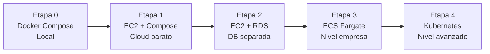

# 🚀 DevOps e Infraestructura — LifeTrack OS

> Para ver el contexto completo ir al [README principal](./README.md)

---

## Estrategia de Infraestructura



| Etapa | Infra | Objetivo |
|-------|-------|----------|
| 0 — Local | Docker Compose | Desarrollar sin gastar. Validar contratos. |
| 1 — EC2 | EC2 t3.medium + Docker Compose + S3 real | Primer deploy cloud. Aprender EC2, SG, IAM. |
| 2 — EC2 + RDS | PostgreSQL en RDS separado | Separar DB. Backups administrados. |
| 3 — ECS Fargate | Cada servicio como Task en ECS + ECR | Contenedores sin administrar servers. |
| 4 — Kubernetes | EKS + Helm + HPA + Ingress | Lo que usan grandes empresas. |

---

## Docker

### Dockerfile Multi-stage (todos los microservicios)

```dockerfile
# Stage 1: Build
FROM node:20-alpine AS builder
WORKDIR /app
COPY package*.json ./
RUN npm ci --frozen-lockfile
COPY . .
RUN npm run build

# Stage 2: Solo dependencias de producción
FROM node:20-alpine AS deps
WORKDIR /app
COPY package*.json ./
RUN npm ci --frozen-lockfile --only=production

# Stage 3: Runtime final (imagen pequeña)
FROM node:20-alpine AS runner
WORKDIR /app
RUN addgroup --system --gid 1001 nodejs && adduser --system --uid 1001 nestjs
COPY --from=builder /app/dist ./dist
COPY --from=deps /app/node_modules ./node_modules
USER nestjs
EXPOSE 3000
HEALTHCHECK --interval=30s CMD wget -qO- http://localhost:3000/health || exit 1
CMD ["node", "dist/main"]
```

### Docker Compose Local

```yaml
services:
  nats:
    image: nats:2.10-alpine
    command: ["--jetstream", "--http_port", "8222"]
    ports: ["4222:4222", "8222:8222"]

  postgres:
    image: postgres:16-alpine
    environment: { POSTGRES_PASSWORD: devpass }

  mongo:
    image: mongo:7

  redis:
    image: redis:7-alpine
    command: ["--maxmemory", "256mb"]

  dynamodb-local:
    image: amazon/dynamodb-local:latest
    ports: ["8000:8000"]

  minio:
    image: minio/minio
    command: server /data --console-address :9001
    ports: ["9000:9000", "9001:9001"]

  prometheus:
    image: prom/prometheus:latest
    ports: ["9090:9090"]

  grafana:
    image: grafana/grafana:latest
    ports: ["3001:3000"]
```

---

## Kubernetes

### Helm Chart por Microservicio

```
lifetrack-k8s/
  charts/
    lifetrack-auth/
      Chart.yaml
      values.yaml
      values-staging.yaml
      templates/
        deployment.yaml
        service.yaml
        hpa.yaml              # Horizontal Pod Autoscaler
        configmap.yaml
    lifetrack-task/
    lifetrack-nats/
    lifetrack-monitoring/     # Prometheus + Grafana stack
  namespaces/
    dev.yaml / staging.yaml / prod.yaml
  ingress/
    ingress-nginx.yaml
```

### HPA — Escalado Automático

```yaml
apiVersion: autoscaling/v2
kind: HorizontalPodAutoscaler
metadata:
  name: task-service-hpa
spec:
  scaleTargetRef:
    kind: Deployment
    name: task-service
  minReplicas: 2
  maxReplicas: 10
  metrics:
    - type: Resource
      resource:
        name: cpu
        target: { type: Utilization, averageUtilization: 70 }
```

---

## AWS — Servicios Usados

| Servicio | Uso | Cuándo activar |
|----------|-----|----------------|
| ECR | Registro privado de imágenes Docker | Desde Etapa 1 |
| EC2 | Servidor inicial con Docker Compose | Etapa 1 |
| S3 | Archivos, media, frontend MFE | Desde Etapa 1 |
| DynamoDB | Auditoría append-only | Desde Etapa 1 |
| RDS PostgreSQL | Base de datos administrada | Etapa 2 |
| ElastiCache Redis | Cache y locks administrados | Etapa 2+ |
| ECS Fargate | Contenedores sin administrar servers | Etapa 3 |
| CloudFront | CDN para el shell y MFEs | Etapa 3 |
| ALB + ACM | Load balancer + HTTPS | Etapa 3 |
| EKS | Kubernetes administrado | Etapa 4 |
| CloudWatch | Logs y métricas básicas | Desde Etapa 1 |
| Secrets Manager | Variables secretas y credenciales | Etapa 2+ |
| AWS Budgets | Alertas de gasto — **OBLIGATORIO desde día 1** | Desde Etapa 1 |

---

## Terraform

```
infra/terraform/
  environments/
    dev/        main.tf · variables.tf · terraform.tfvars
    staging/
    prod/
  modules/
    ecr/        budgets/    rds-postgres/   iam/
    s3/         ec2-docker/ ecs-fargate/    cloudwatch/
    dynamodb/   eks-cluster/ security-groups/ alb/
```

### Budget Alert — obligatorio antes de cualquier deploy

```hcl
resource "aws_budgets_budget" "monthly" {
  name         = "lifetrack-monthly"
  budget_type  = "COST"
  limit_amount = "20"
  limit_unit   = "USD"
  time_unit    = "MONTHLY"

  notification {
    threshold                  = 80
    threshold_type             = "PERCENTAGE"
    comparison_operator        = "GREATER_THAN"
    notification_type          = "ACTUAL"
    subscriber_email_addresses = [var.alert_email]
  }
}
```

---

## Observabilidad

### Prometheus — métricas por servicio

```yaml
# prometheus/prometheus.yml
scrape_configs:
  - job_name: "auth-service"
    static_configs:
      - targets: ["auth-service:3000"]
  - job_name: "task-service"
    static_configs:
      - targets: ["task-service:3000"]
  # ... un job por servicio
```

### Métricas custom en NestJS

```typescript
// Instalar: @willsoto/nestjs-prometheus prom-client
const grpcLatency = new Histogram({
  name: "grpc_server_handling_seconds",
  labelNames: ["method", "status"],
  buckets: [0.01, 0.05, 0.1, 0.5, 1, 2, 5],
});

const eventsPublished = new Counter({
  name: "nats_events_published_total",
  labelNames: ["event_type", "status"],
});
```

### Dashboards Grafana

| Dashboard | Qué muestra |
|-----------|-------------|
| System Overview | Todos los servicios, latencia global, error rate, eventos/min |
| Per Service | Latencia p50/p95/p99, errores, DB queries, NATS events |
| NATS JetStream | Mensajes publicados, pendientes, DLQ size |
| Infrastructure | CPU, memoria, disco por pod/container |
| Security | Login fallidos, vault accesses, rate limit hits |

### Alertas configuradas

- Servicio caído → alerta crítica (2 minutos sin respuesta)
- Latencia alta → alerta warning (p95 > 2s)
- Error rate > 5% en 5 minutos → alerta crítica
- NATS DLQ con mensajes → alerta warning
- Budget AWS > 80% → alerta urgente

---

### OpenTelemetry — Trazas Distribuidas

```typescript
// tracing/otel.ts — inicializar antes de NestJS
import { NodeSDK } from "@opentelemetry/sdk-node";
import { OTLPTraceExporter } from "@opentelemetry/exporter-trace-otlp-http";

const sdk = new NodeSDK({
  resource: new Resource({ [ATTR_SERVICE_NAME]: process.env.SERVICE_NAME }),
  traceExporter: new OTLPTraceExporter({ url: process.env.OTEL_ENDPOINT }),
});
sdk.start();

// Resultado visible en Grafana Tempo o Jaeger:
// REST /api/tasks/create (50ms)
//   └── gRPC task-service.CreateTask (30ms)
//         └── DB INSERT tasks (15ms)
//         └── NATS publish task.created.v1 (5ms)
```

---

> Ver también: [Arquitectura](./ARCHITECTURE.md) · [Backend](./BACKEND.md) · [Frontend](./FRONTEND.md) · [CI/CD](./CICD.md)
