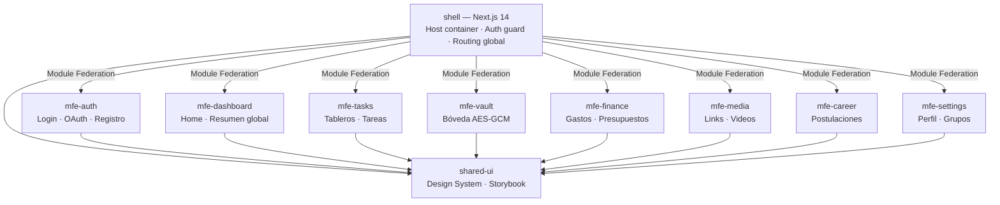
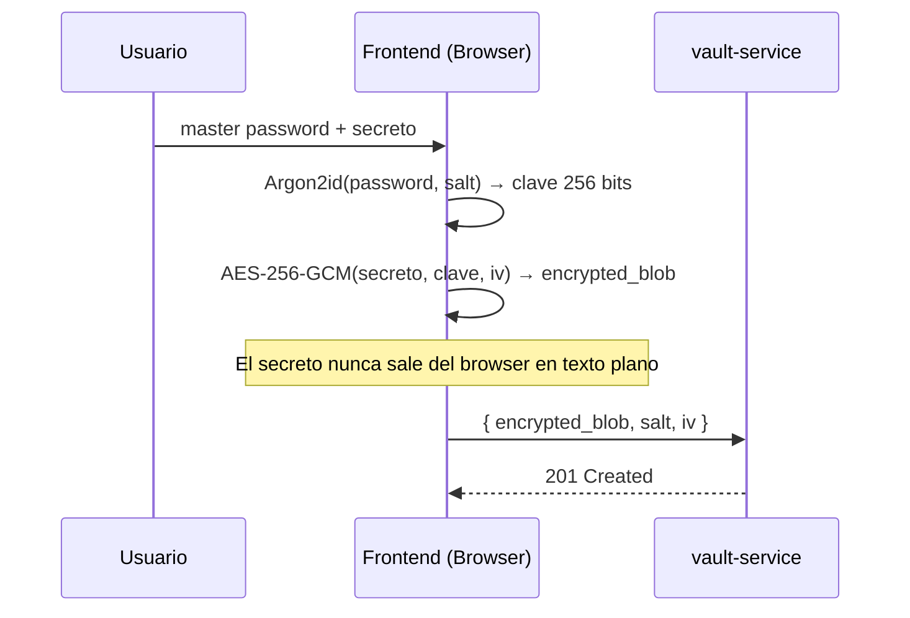

# 🎨 Frontend y Microfrontend — LifeTrack OS

> Para ver el contexto completo ir al [README principal](./README.md)

---

## Arquitectura Microfrontend



Cada MFE es una aplicación independiente deployable. El shell las carga en tiempo de ejecución con **Module Federation (Webpack 5)**. Si un MFE falla, el resto sigue funcionando.

---

## Stack Tecnológico

| Tecnología | Uso |
|-----------|-----|
| Next.js 14 App Router | Shell y MFEs principales — SSR, RSC, Server Actions, Middleware |
| React 18 + TypeScript | UI library en todos los MFEs |
| Module Federation | Carga de MFEs remotos en el shell en tiempo de ejecución |
| React Query | Server state — cache inteligente, refetch, mutations |
| Zustand | Client state — UI state, preferencias locales |
| Tailwind CSS | Utility-first CSS en todo el sistema |
| shadcn/ui | Componentes accesibles base (Radix UI) |
| Framer Motion | Animaciones y microinteracciones |
| React Hook Form + Zod | Formularios con validación tipada |
| Storybook | Documentación visual del design system |
| Playwright | Tests E2E en navegador real |

---

## Module Federation — Config del Shell

```javascript
// shell/next.config.js
const { NextFederationPlugin } = require("@module-federation/nextjs-mf");

module.exports = {
  webpack(config) {
    config.plugins.push(new NextFederationPlugin({
      name: "shell",
      remotes: {
        mfeTasks:   `mfeTasks@${process.env.MFE_TASKS_URL}/_next/static/chunks/remoteEntry.js`,
        mfeVault:   `mfeVault@${process.env.MFE_VAULT_URL}/remoteEntry.js`,
        mfeMedia:   `mfeMedia@${process.env.MFE_MEDIA_URL}/remoteEntry.js`,
        mfeFinance: `mfeFinance@${process.env.MFE_FINANCE_URL}/_next/static/chunks/remoteEntry.js`,
      },
      shared: {
        react: { singleton: true },
        "react-dom": { singleton: true }
      }
    }));
    return config;
  }
};
```

---

## Estado — React Query vs Zustand

```
Server state (datos de la API)  →  React Query
Client state (UI, preferencias) →  Zustand

Regla: NUNCA usar Zustand para datos del servidor.
```

```typescript
// React Query — datos del servidor
const { data: tasks } = useQuery({
  queryKey: ["tasks", spaceId],
  queryFn: () => api.tasks.list({ spaceId }),
  staleTime: 30_000,
});

const createTask = useMutation({
  mutationFn: api.tasks.create,
  onSuccess: () => queryClient.invalidateQueries(["tasks", spaceId]),
});

// Zustand — estado del cliente
const useUIStore = create((set) => ({
  sidebarOpen: true,
  activeSpaceId: null,
  toggleSidebar: () => set(s => ({ sidebarOpen: !s.sidebarOpen })),
}));
```

---

## Vault — Cifrado en el Browser



```typescript
// lib/vault-crypto.ts — solo corre en el cliente
export async function encryptSecret(secret: string, key: CryptoKey) {
  const iv = crypto.getRandomValues(new Uint8Array(12));
  const encoded = new TextEncoder().encode(secret);
  const encrypted = await crypto.subtle.encrypt({ name: "AES-GCM", iv }, key, encoded);
  return {
    encrypted_blob: btoa(String.fromCharCode(...new Uint8Array(encrypted))),
    iv: btoa(String.fromCharCode(...iv)),
  };
}
```

**Reglas de seguridad del mfe-vault:**
- `ssr: false` — el cifrado ocurre solo en el cliente, nunca en el servidor
- El master password NUNCA se guarda en localStorage ni cookies
- Timeout automático: si el usuario está inactivo 5 minutos, se limpia de memoria
- CSP estricta para prevenir XSS

---

## OAuth en el Frontend

```typescript
// Paso 1: redirect a Google
const { redirectUrl } = await api.auth.getOAuthRedirectUrl("google");
window.location.href = redirectUrl;

// Paso 2: callback del servidor (Next.js route)
// shell/src/app/auth/callback/google/page.tsx
export default async function GoogleCallback({ searchParams }) {
  const tokens = await authService.exchangeOAuthCode("google", searchParams.code);
  // Token en cookie httpOnly — protegido contra XSS
  cookies().set("access_token", tokens.accessToken, { httpOnly: true, secure: true });
  redirect("/dashboard");
}
```

**Gestión de tokens:**
- Access token: cookie `httpOnly + Secure + SameSite=Strict` — nunca en localStorage
- Refresh token: también cookie httpOnly. Se rota en cada uso.
- Interceptor de axios: detecta 401 y hace refresh silencioso automático

---

## Testing Frontend

| Tipo | Herramienta | Qué testea |
|------|-------------|-----------|
| Unit | Vitest + React Testing Library | Componentes, hooks, stores |
| Integration | Vitest + MSW (Mock Service Worker) | Flujos con API mock |
| Visual | Storybook + Chromatic | Regresión visual de componentes |
| E2E | Playwright | Flujos completos en navegador real |
| Accesibilidad | axe-core + jest-axe | WCAG 2.1 AA |
| Performance | Lighthouse CI | LCP, FID, CLS en cada deploy |

### Ejemplo E2E — Playwright

```typescript
test("crear tarea desde el dashboard", async ({ page }) => {
  await loginAs(page, "alice@test.com");
  await page.goto("/spaces/sp-123/tasks");
  await page.click("[data-testid=btn-new-task]");
  await page.fill("[data-testid=input-task-title]", "Revisar PR de autenticación");
  await page.click("[data-testid=btn-submit-task]");
  await expect(page.locator("text=Revisar PR de autenticación")).toBeVisible();
});
```

---

> Ver también: [Arquitectura](./ARCHITECTURE.md) · [Backend](./BACKEND.md) · [DevOps](./DEVOPS.md) · [CI/CD](./CICD.md)
