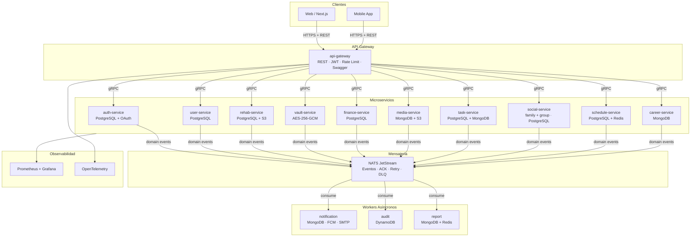
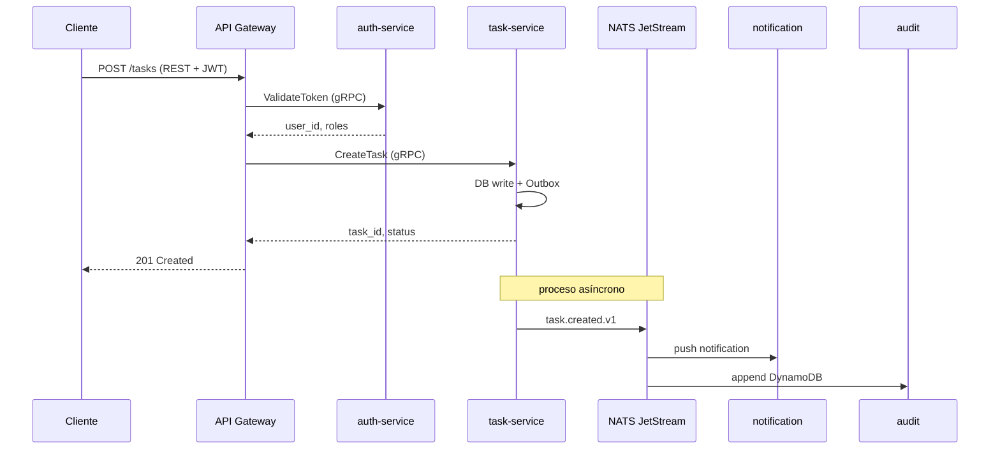
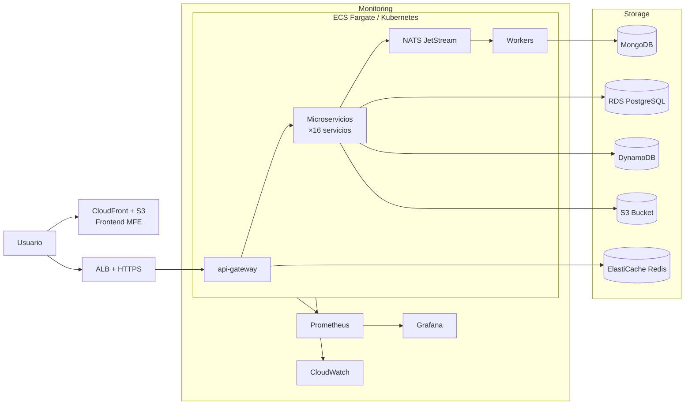
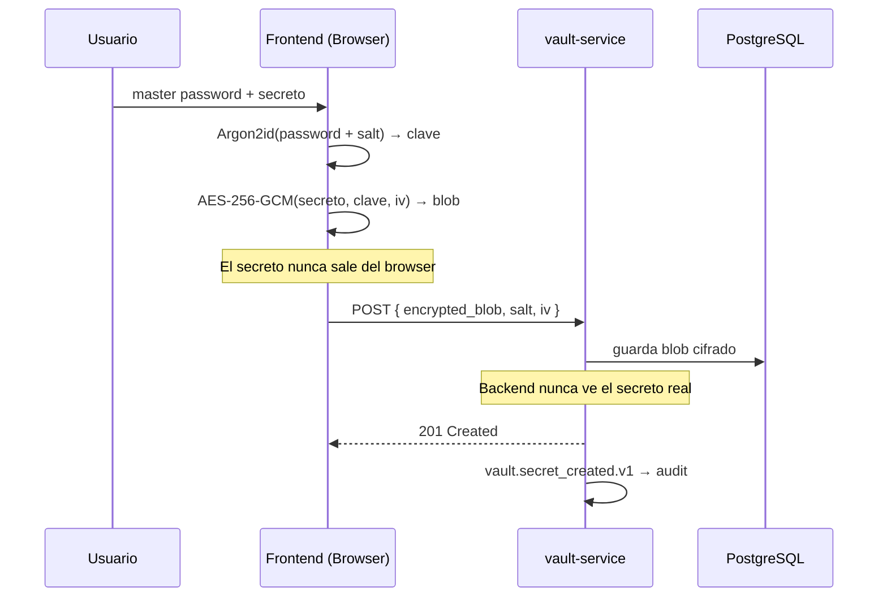

# 🧠 LifeTrack OS

> Plataforma personal y familiar de productividad construida con arquitectura de microservicios empresarial real.

**Stack:** NestJS · gRPC · NATS JetStream · PostgreSQL · MongoDB · DynamoDB · Redis · S3 · Next.js · Docker · Kubernetes · AWS · Terraform · GitHub Actions · Jenkins · SonarQube · Prometheus · Grafana · OpenTelemetry

---

## 📌 Descripción

LifeTrack OS es una plataforma que centraliza tareas, finanzas, archivos, postulaciones laborales, bóveda segura de contraseñas y más — construida con el stack que usan empresas tecnológicas reales. El objetivo es aprender haciendo: cada módulo enseña una tecnología distinta que la industria exige.

**Problemática:** Las personas manejan su vida digital dispersa en múltiples apps sin integración. LifeTrack unifica todo en un solo sistema seguro y personalizable.

**Usuario objetivo:** Personas y familias que quieren organizar su vida digital con privacidad real y acceso desde cualquier dispositivo.

---

## 📚 Documentación — Índice General

| Documento | Descripción |
|-----------|-------------|
| [README principal](./README.md) | Este archivo — visión general + diagramas |
| [Arquitectura](./ARCHITECTURE.md) | Principios, módulos, decisiones de diseño |
| [Backend](./BACKEND.md) | Microservicios, gRPC, NATS, hexagonal, testing |
| [Frontend](./FRONTEND.md) | Microfrontend, Next.js, React Query, Vault UI |
| [DevOps & Infra](./DEVOPS.md) | Docker, Kubernetes, AWS, Terraform, Prometheus |
| [CI/CD & Calidad](./CICD.md) | GitHub Actions, Jenkins, SonarQube, TDD, BDD |

---

## 🏗️ Arquitectura General



---

## 🔄 Flujo de un Request



---

## ☁️ Despliegue AWS



---

## 🔐 Cifrado del Vault



---

## 🗂️ Módulos del Sistema

Arquitectura consolidada en **13 microservicios de dominio** (bajado de un roadmap inicial de 17 tras un análisis de bounded contexts: `family-service` + `group-service` se fusionaron en `social-service` por tener el mismo modelo de datos; `space-service` se fusionó en `task-service` por alto acoplamiento; `business-service` y `file-service` se eliminaron por no tener un propósito definido ni un consumidor real — el storage de archivos se resuelve con una librería S3 compartida usada directo por cada dominio, no un servicio de red aparte).

**Regla de construcción:** cada servicio se implementa solo cuando tiene un consumidor real esperándolo, no porque esté en este diagrama. Ver [Arquitectura → Fases de Desarrollo](./ARCHITECTURE.md#fases-de-desarrollo) para el orden.

| Módulo | Tecnología | Estado |
|--------|-----------|--------|
| auth-service | NestJS + PostgreSQL + OAuth Google/GitHub | ✅ Hecho |
| user-service | NestJS + PostgreSQL + Push devices | ✅ Hecho |
| api-gateway | NestJS + REST + JWT + Swagger | ✅ Hecho |
| rehab-service | NestJS + PostgreSQL + S3 (fotos) | 🔧 Siguiente (Fase 2) |
| vault-service | NestJS + PostgreSQL + AES-256-GCM | 📋 Planificado (Fase 3) |
| finance-service | NestJS + PostgreSQL | 📋 Planificado (Fase 3) |
| media-service | NestJS + MongoDB + S3 | 📋 Planificado (Fase 4) |
| task-service | NestJS + PostgreSQL + MongoDB (plantillas) | 📋 Planificado (Fase 4, opcional) |
| social-service *(family + group)* | NestJS + PostgreSQL | 📋 Planificado (Fase 5) |
| schedule-service | NestJS + PostgreSQL + Redis | 📋 Planificado (Fase 5) |
| career-service | NestJS + MongoDB | 📋 Planificado (Fase 5) |
| notification-service | NestJS + MongoDB + FCM + SMTP | ⏸️ Pausado, sin necesidad concreta |
| audit-service | NestJS + DynamoDB | ⏸️ Pausado, sin necesidad concreta |
| report-service | NestJS + MongoDB + Redis | ⏸️ Pausado, sin necesidad concreta |

---

## 🧩 Módulos Opcionales por Usuario

No todos los usuarios necesitan todos los módulos (ej. no todos llevan rehabilitación física). Cada módulo se activa explícitamente, no aparece solo:

- **Catálogo de módulos**: lista de módulos existentes (`tasks`, `finance`, `rehab`, `vault`, etc.), visible para todos.
- **`user_modules`** (en `user-service`): tabla `user_id + module_key + activo`, define qué módulos ve cada usuario en su dashboard/menú.
- **Activación explícita**: un módulo nuevo no se agrega solo al `enabled_modules` de usuarios existentes — aparece en una sección "Descubrir módulos" y el usuario decide activarlo.
- **Plantillas de onboarding**: combos predefinidos de módulos para casos de uso comunes (ej. plantilla "Recuperación deportiva" activa `rehab` de una vez — `rehab-service` maneja sus propias citas y fotos internamente, no depende de otros módulos), ofrecidas a usuarios nuevos en el registro.
- **`rehab-service`**: dentro del módulo de rehabilitación, cada lesión/parte del cuerpo es un `recovery_plan` independiente (rodilla, hombro, etc.), cada uno con sus propios ejercicios, citas, medidas y fotos — un usuario puede tener varios en paralelo sin que se mezclen.

---

## 🚀 Correr el Proyecto Localmente

```bash
# 1. Clonar
git clone https://github.com/tu-usuario/lifetrack-os.git
cd lifetrack-os

# 2. Levantar infraestructura base
cd lifetrack-infra
cp .env.example .env
docker compose up -d
# Levanta: NATS · PostgreSQL · MongoDB · Redis · DynamoDB Local · MinIO · Prometheus · Grafana

# 3. Correr auth-service
cd services/auth-service
cp .env.example .env && npm install
npx prisma migrate dev
npm run start:dev

# 4. Correr api-gateway
cd services/api-gateway
cp .env.example .env && npm install
npm run start:dev

# 5. Verificar
curl http://localhost:3000/health
```

---

## 🤖 IA en el Proyecto

| Herramienta | Modelo | Uso |
|-------------|--------|-----|
| Anthropic Claude API | claude-sonnet-4-6 | Asistente personal, sugerencias de tareas, resúmenes |
| OpenAI API | gpt-4o | Análisis de postulaciones, resúmenes financieros |
| Hugging Face | distilbert | Clasificación automática de prioridades y gastos |

---

## 👤 Equipo

| Nombre | Rol |
|--------|-----|
| [Tu nombre] | Full Stack Developer · DevOps · Arquitecto |

---

## 📦 Release

**Release:** `Prototipo de arquitectura - LifeTrack OS`

Incluye documentación completa, diagramas y estructura base del proyecto.
