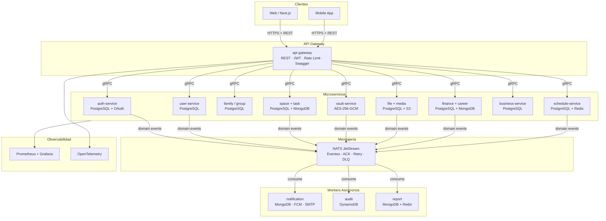
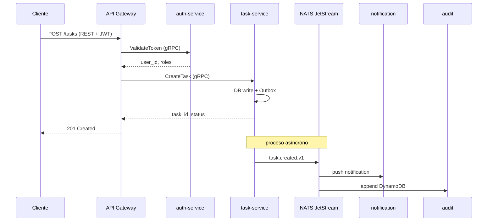
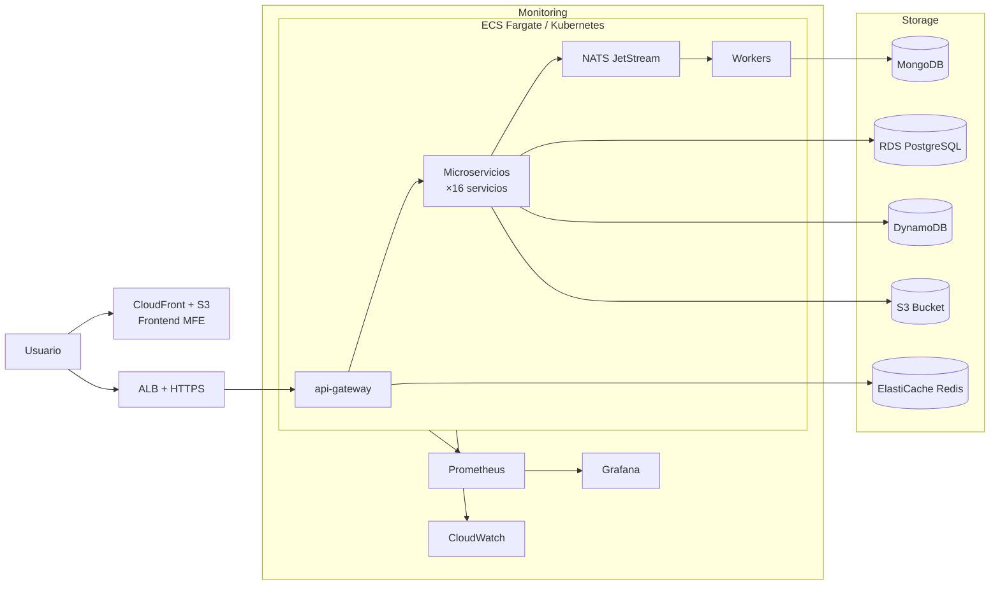
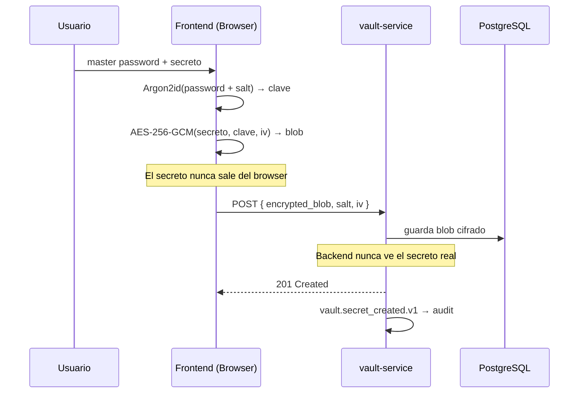

# 🧠 LifeTrack OS

> Plataforma personal y familiar de productividad construida con arquitectura de microservicios empresarial real.

**Stack:** NestJS · gRPC · NATS JetStream · PostgreSQL · MongoDB · DynamoDB · Redis · S3 · Next.js · Docker · Kubernetes · AWS · Terraform · GitHub Actions · Jenkins · SonarQube · Prometheus · Grafana · OpenTelemetry

---

## 📌 Descripción

LifeTrack OS es una plataforma que centraliza tareas, finanzas, archivos, postulaciones laborales, bóveda segura de contraseñas y más — construida con el stack que usan empresas tecnológicas reales. El objetivo es aprender haciendo: cada módulo enseña una tecnología distinta que la industria exige.

**Problemática:** Las personas manejan su vida digital dispersa en múltiples apps sin integración. LifeTrack unifica todo en un solo sistema seguro y personalizable.

**Usuario objetivo:** Personas y familias que quieren organizar su vida digital con privacidad real y acceso desde cualquier dispositivo.

---

## 📚 Documentación — Índice General

| Documento | Descripción |
|-----------|-------------|
| [README principal](./README.md) | Este archivo — visión general + diagramas |
| [Arquitectura](./ARCHITECTURE.md) | Principios, módulos, decisiones de diseño |
| [Backend](./BACKEND.md) | Microservicios, gRPC, NATS, hexagonal, testing |
| [Frontend](./FRONTEND.md) | Microfrontend, Next.js, React Query, Vault UI |
| [DevOps & Infra](./DEVOPS.md) | Docker, Kubernetes, AWS, Terraform, Prometheus |
| [CI/CD & Calidad](./CICD.md) | GitHub Actions, Jenkins, SonarQube, TDD, BDD |

---

## 🏗️ Arquitectura General



---

## 🔄 Flujo de un Request



---

## ☁️ Despliegue AWS



---

## 🔐 Cifrado del Vault



---

## 🗂️ Módulos del Sistema

| Módulo | Tecnología | Estado |
|--------|-----------|--------|
| auth-service | NestJS + PostgreSQL + OAuth Google/GitHub | 🔧 En desarrollo |
| user-service | NestJS + PostgreSQL + Push devices | 🔧 En desarrollo |
| family-service | NestJS + PostgreSQL | 📋 Planificado |
| group-service | NestJS + PostgreSQL | 📋 Planificado |
| space-service | NestJS + PostgreSQL + MongoDB | 📋 Planificado |
| task-service | NestJS + PostgreSQL | 📋 Planificado |
| schedule-service | NestJS + PostgreSQL + Redis | 📋 Planificado |
| file-service | NestJS + PostgreSQL + S3 | 📋 Planificado |
| media-service | NestJS + MongoDB + S3 | 📋 Planificado |
| finance-service | NestJS + PostgreSQL | 📋 Planificado |
| vault-service | NestJS + PostgreSQL + AES-256-GCM | 📋 Planificado |
| career-service | NestJS + MongoDB | 📋 Planificado |
| business-service | NestJS + PostgreSQL + TypeORM | 📋 Planificado |
| notification-service | NestJS + MongoDB + FCM + SMTP | 📋 Planificado |
| audit-service | NestJS + DynamoDB | 📋 Planificado |
| report-service | NestJS + MongoDB + Redis | 📋 Planificado |

---

## 🚀 Correr el Proyecto Localmente

```bash
# 1. Clonar
git clone https://github.com/tu-usuario/lifetrack-os.git
cd lifetrack-os

# 2. Levantar infraestructura base
cd lifetrack-infra
cp .env.example .env
docker compose up -d
# Levanta: NATS · PostgreSQL · MongoDB · Redis · DynamoDB Local · MinIO · Prometheus · Grafana

# 3. Correr auth-service
cd services/auth-service
cp .env.example .env && npm install
npx prisma migrate dev
npm run start:dev

# 4. Correr api-gateway
cd services/api-gateway
cp .env.example .env && npm install
npm run start:dev

# 5. Verificar
curl http://localhost:3000/health
```

---

## 🤖 IA en el Proyecto

| Herramienta | Modelo | Uso |
|-------------|--------|-----|
| Anthropic Claude API | claude-sonnet-4-6 | Asistente personal, sugerencias de tareas, resúmenes |
| OpenAI API | gpt-4o | Análisis de postulaciones, resúmenes financieros |
| Hugging Face | distilbert | Clasificación automática de prioridades y gastos |

---

## 👤 Equipo

| Nombre | Rol |
|--------|-----|
| [Tu nombre] | Full Stack Developer · DevOps · Arquitecto |

---

## 📦 Release

**Release:** `Prototipo de arquitectura - LifeTrack OS`

Incluye documentación completa, diagramas y estructura base del proyecto.
